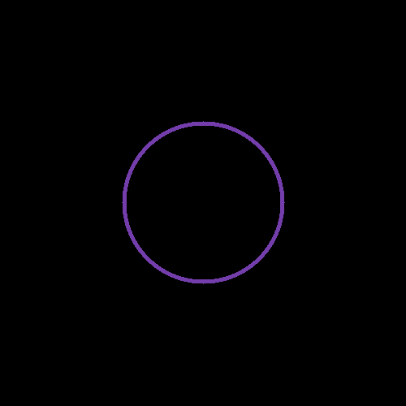
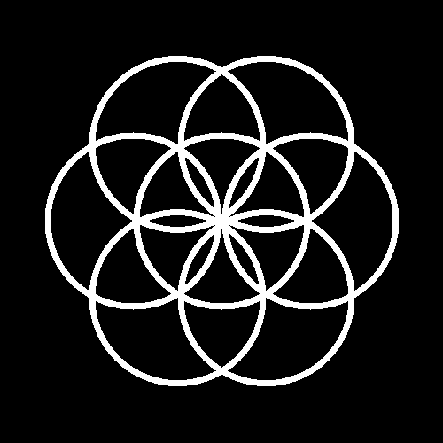
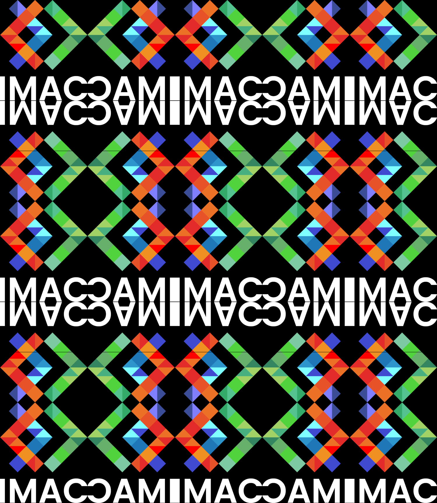
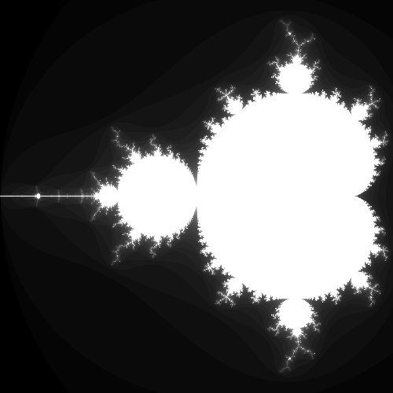

# 😸 S1 | Prog: Workshop 
### *Eléa Crunchant & Nolan Bourrel*

> Pour ce projet, nous avons décidé de réaliser les exercices dans l'ordre de la consigne afin de parcourir les difficultés dans l'ordre croissant. Nous avons pu ainsi obtenir des bases solides pour avancer dans les exercices les plus complexes.

---

## Ne garder que le vert (⭐️)
| _AVANT_                | ✨ _APRÈS_ ✨             |
| ---------------------- | ----------------------- |
|  |  |

Pour ce filtre, nous n'avons pas rencontré de difficulté particulière. Nous avons utilisé une petite boucle for() pour ne garder que le vert sur chacun des pixels et réduire les autres à 0.f (noir).

---

## Échanger les canaux (⭐️)
| _AVANT_                | ✨ _APRÈS_ ✨            |
| ---------------------- | ---------------------- |
|  |  |

Idem que pour le filtre précédent, mais nous avons pu utiliser la fonction swap pour ce filtre.

---

## Noir & Blanc (⭐️)
| _AVANT_                | ✨ _APRÈS_ ✨          |
| ---------------------- | -------------------- |
|  |  |

Pour ce filtre, nous avons manipulé des moyennes. Nous avons fait la moyenne des intensités des couleurs RGB pour chaque pixel et lui avons appliqué cette moyenne comme nouvelle valeur. 
> si chacun des canaux possède la même valeur, alors la couleur sera forcément une nuance de gris.

---

## Négatif (⭐️)
| _AVANT_                | ✨ _APRÈS_ ✨               |
| ---------------------- | ------------------------- |
|  |  |

Nous avons utilisé le même procédé que pour les filtres précédents mais nous avons inversé la couleur. 
> L'inversion de la couleur consiste à la remplacer par sa couleur opposée obtenue par le calcul : (1 - elle-même)

---

## Dégradé (⭐️)
| _AVANT_                           | ✨ _APRÈS_ ✨                |
| --------------------------------- | -------------------------- |
|  |  |


Nous avons rencontré un peu plus de difficultés en réalisant ce dégradé. En effet, nous savions que la couleur de chaque pixel dépendait de sa position x. 

Cependant, nous obtenions un grand rectangle noir et nous ne comprenions pas pourquoi le dégradé ne s'affichait pas correctement. 

Finalement, nous nous sommes rendus compte que nous avions mal implémenté notre boucle for(). Nous avions initialisé x et y comme des int et non des float. 

``` C++
for (int x{0}; x < image.width(); x++)
```
``` C++
for (float x{0.f}; x < image.width(); x++)
```

La division par des int nous donnant toujours des valeurs proches de 0 qui se convertissaient donc automatiquement en 0 ne nous donnaient que des pixels noirs et une ligne blanche.

---

## Miroir (⭐️⭐️)
| _AVANT_                | ✨ _APRÈS_ ✨              |
| ---------------------- | ------------------------ |
|  |  |


Pour ce filtre, nous avons simplement créé une inversion entre la première moitié des pixels et la dernière moitié. 

Nous avons pris le premier pixel (x, y), que nous avons stocké dans une variable. Nous avons ensuite appliqué la couleur du dernier pixel (image.width(), image.height()) à notre premier pixel. Pour finir, nous avons associé la couleur du premier pixel stocké dans la variable, au dernier pixel. 

Nous avons répété ensuite cette opération sur les pixels suivants, le pixel(x+1, y+1) et le pixel (image.width()-1, image.height()-1)

> il faut bien faire attention à ne faire ces opérations sur la moitié de l'image pour éviter de se retrouver avec une demi-inversion.

---

## Image bruitée (⭐️⭐️)
| _AVANT_                | ✨ _APRÈS_ ✨             |
| ---------------------- | ----------------------- |
|  |  |


Pour créer cette image bruitée, nous avons sélectectionné des pixels au hasard sur l'image et nous lui avons associé une nouvelle couleur aléatoire.

Pour ce faire, nous avons utilisé la fonction random_int et random_float :
```c++
image.pixel(random_int(0, image.width()), random_int(0, image.height())) = random_float(0, 1)
```

---

## Rotation à 90° (⭐️⭐️)
| _AVANT_                | ✨ _APRÈS_ ✨             |
| ---------------------- | ----------------------- |
|  |  |

Lors de la création de la rotation, nous avions compris qu'il fallait déplacer les pixels. Cependant, nous n'avions pas pensé à créer une nouvelle image. Les pixels ne pouvant pas se placer dans "rien", nous avons eu une erreur que nous avons mis du temps à comprendre. 

Une fois que nous avions compris qu'il fallait créer une nouvelle image qui possède la même largeur que la hauteur de l'image originelle et la même hauteur que la largeur de l'image d'origine et associer les pixels de la nouvelle image à l'image originelle, nous avons réussi à créer notre rotation.

``` c++
sil::Image image2{image.height() /*width*/, image.width() /*height*/};
```

---

## RGB Split (⭐️⭐️)
| _AVANT_                | ✨ _APRÈS_ ✨             |
| ---------------------- | ----------------------- |
|  |  |

Pour le filtre RGB Split, nous avons utilisé une valeur décalage pour interagir sur les pixels de l'image. Nous avons aussi pensé que le décalage allait faire sortir la range de notre boucle for des dimensions de l'image, donc grâce à des if, nous nous sommes occupé des cas particuliers.


``` c++
if ((x + decalage) >= image.width())
```

---

## Luminosité (⭐️⭐️)
| _AVANT_                | ✨ _Luminosité basse_ ✨             | ✨ _Luminosité haute_ ✨             |
| ---------------------- | ----------------------- | ----------------------- |
|  |  |  |

Pour le filtre Luminosité, nous avons pensé à faire les deux cas (luminosité haute et basse) dans le même algorithme. 
Pour augmenter la luminosité d'un pixel, il suffit d'appliquer une puissance inférieure à 1 a la valeur RGB de chacune de ses composantes. 
Pour diminuer la luminosité d'un pixel, c'est le procédé inverse. On applique une puissance supérieure à 1.


``` c++
pow((image.pixel(x, y).r), 0.5)
```

---

## Disque (⭐️⭐️)
| _AVANT_                           | ✨ _APRÈS_ ✨                |
| --------------------------------- | -------------------------- |
|  |  |

Pour le disque, pas de grande difficulté rencontrée. Grâce à un if, nous avons simplement appliqué la formule mathématique d'une équation de cercle à nos variables :

``` C++
pow((x - (disque.width() / 2)), 2) + pow((y - (disque.height() / 2)), 2) <= (r * r)
```

Ainsi, si notre pixel respecte la condition, c'est-à-dire s'il se trouve dans l'aire du disque, on les colore (dans notre cas en violet).

---

## Cercle (⭐️)
| _AVANT_                           | ✨ _APRÈS_ ✨                |
| --------------------------------- | -------------------------- |
|  |  |

Pour le cercle, nous avons simplement rajouté une condition d'épaisseur pour trier les pixels à colorer : 

``` C++
int thinkeness{5};
if (pow((x - (cercle.width() / 2)), 2) + pow((y - (cercle.height() / 2)), 2) <= (r * r) and 
    pow((x - (cercle.width() / 2)), 2) + pow((y - (cercle.height() / 2)), 2) >= ((r - thinkeness) * (r - thinkeness)))
```

---

## Rosace (⭐️⭐️⭐️)
| _AVANT_                           | ✨ _APRÈS_ ✨                |
| --------------------------------- | -------------------------- |
|  |  |

Pour la rosace, nous savions déjà comment faire afficher un cercle. Nous n'avions plus qu'à savoir comment les manipuler pour les afficher à des endroits précis, notament les points cardinaux d'un cercle. Nous avons donc utilisé la formule pour passer des coordonées polaires aux coordonnées cartésiennes. On a donc créé un cercle au centre de l'image, puis grâce à une boucle for, créé un nouveau cercle tous les PI/3 sur le cercle.
``` C++
for (int i{0}; i <= 5; i++)
puis
if (
    pow((x - ((rosace.width() / 2) + (r * cos((i * M_PI) / 3)))), 2) +
        pow((y - ((rosace.width() / 2) + (r * sin((i * M_PI) / 3)))), 2) <=
        (r * r) and
    pow((x - ((rosace.width() / 2) + (r * cos((i * M_PI) / 3)))), 2) +
        pow((y - ((rosace.width() / 2) + (r * sin((i * M_PI) / 3)))), 2) >=
        ((r_dessin - thinkeness) * (r_dessin - thinkeness))
    )
alors on met le pixel en blanc :
        rosace.pixel(x, y).r = 1.f;
        rosace.pixel(x, y).g = 1.f;
        rosace.pixel(x, y).b = 1.f;
```

---

## Mosaïque (⭐️⭐️)
| _AVANT_                | ✨ _APRÈS_ ✨             |
| ---------------------- | ----------------------- |
|  |  |

Pour le filtre Mosaïque, nous avons créé une nouvelle image de 5 fois la largeur et la hauteur de celle que nous voulions transformer en mosaïque. Puisn grâce à l'opérateur modulo (%) nous avons rempli la nouvelle image 25 fois avec celle de base.


``` c++
mosaique.pixel(x, y) = image.pixel(x % image.width(), y % image.height());
```

---

## Mosaïque Miroir (⭐️⭐️⭐️)
| _AVANT_                | ✨ _APRÈS_ ✨             |
| ---------------------- | ----------------------- |
|  |  |

Pour le filtre Mosaïque Miroir, un peu plus de difficulté. Majoritairement les mêmes procédés que pour la mosaïque sauf qu'il a fallu créer un paterne avec chacune des versions (normale/miroir/inversée/miroir inversée), puis remplir l'image avec ce nouveau paterne.

``` c++
Remplissage du paterne avec les différentes versions du logo de base :
if (x > image.width() && y > image.height())
            {
                patern.pixel(x, y) = inverted_mirror.pixel(x % inverted_mirror.width(), y % inverted_mirror.height());
            }
            if (x < image.width() && y > image.height())
            {
                patern.pixel(x, y) = inverted_image.pixel(x % inverted_image.width(), y % inverted_image.height());
            }
            if (x > image.width() && y < image.height())
            {
                patern.pixel(x, y) = mirror.pixel(x % mirror.width(), y % mirror.height());
            }
            if (x < image.width() && y < image.height())
            {
                patern.pixel(x, y) = image.pixel(x % image.width(), y % image.height());
            }
Puis on répète ce paterne dans la grande image :
mosaique.pixel(x, y) = patern.pixel(x % patern.width(), y % patern.height());
```

---

## Glitch (⭐️⭐️⭐️)
| _AVANT_                | ✨ _APRÈS_ ✨             |
| ---------------------- | ----------------------- |
|  |  |

Pour le filtre Glitch, on crée deux rectangles de mêmes dimensions mais aléatoires, on leur attribue une position aléatoir sur l'image et on les remplit des pixels à cet emplacement de l'image. Puis on inverse ces rectangles et on les insère dans l'image de base.

---

## Fractale de Mandelbrot (⭐️⭐️⭐️)
| _AVANT_                           | ✨ _APRÈS_ ✨                |
| --------------------------------- | -------------------------- |
|  |  |

Pour la fractale de Mandelbrot, nous avons manipulé les complexes. Grâce à une condition sur :
``` C++
std::abs(z) > 2; 
```
On a pu jouer avec la luminosité des pixels avec une boucle while et un compteur. Plus la condition était respectée tôt, plus le pixel était sombre. Et sinon , il devenait blanc. 

---

## Vortex (⭐️⭐️⭐️(⭐️))
| _AVANT_                | ✨ _APRÈS_ ✨             |
| ---------------------- | ----------------------- |
|  |  |

Pour le filtre Vortex, on a pu travailler avec des vecteurs pour la position des pixels. On appliquait une fonction de rotation sur ce vecteur afin d'en récuperer un nouveau (une position finale), et après avoir rajouté une condition if pour ne pas traiter les pixels qui sortiraient de l'image, nous sommes arrivés au résultat.
``` C++
 if (pos_finale.x >= image.width() || pos_finale.x < 0 || pos_finale.y >= image.height() || pos_finale.y < 0){}
```
---

## Tramage (⭐️⭐️⭐️(⭐️))
| _AVANT_                | ✨ _APRÈS_ ✨|
| ---------------------- | ----------------------- |
|  |  |

Pour le filtre Dithering (ou Tramage), on a utilisé la matrice de Bayer :

``` c++
float bayer_matrix_4x4[][bayer_n] = {
        {-0.5, 0, -0.375, 0.125},
        {0.25, -0.25, 0.375, -0.125},
        {-0.3125, 0.1875, -0.4375, 0.0625},
        {0.4375, -0.0625, 0.3125, -0.1875}}
```
On a ensuite calculé une valeur de bayer pour chaque pixel pour ensuite l'ajouter à sa couleur moyenne. Et si ce résultatfinal était plus clair que 0.5f, alors le pixel devenait blanc, sinon noir.

---

## Normalisation de l'histogramme (⭐️⭐️⭐️(⭐️))
| _AVANT_                | ✨ _APRÈS_ ✨|
| ---------------------- | ----------------------- |
|  |  |

Pour le filtre Normalisation, on a cherché le pixel le plus sombre et le plus clair de l'image. Puis pour chaque pixel de l'image, on a calculé son rapport avec la moyenne entre le pixel le plus sombre et le plus clair. Et finalement, chaque pixel a pris sa couleur normalisée (en fonction de son rapport au pixel moyen) :

``` c++
 if (pixel_color < moy)
            {
                normalisation.pixel(x, y).r = (image.pixel(x, y).r) - (min * dist);
                normalisation.pixel(x, y).g = (image.pixel(x, y).g) - (min * dist);
                normalisation.pixel(x, y).b = (image.pixel(x, y).b) - (min * dist);
            }
            else
            {
                normalisation.pixel(x, y).r = (image.pixel(x, y).r) + ((1 - max) * dist);
                normalisation.pixel(x, y).g = (image.pixel(x, y).g) + ((1 - max) * dist);
                normalisation.pixel(x, y).b = (image.pixel(x, y).b) + ((1 - max) * dist);}
```

---

## Convolutions (⭐️⭐️⭐️⭐️)
| _AVANT_                | ✨ _APRÈS_ ✨             |
| ---------------------- | ----------------------- |
|  |  |

Pour le filtre Convolution, on a découvert et manipulé les Kernel. On parcourt l'image pixel par pixel ainsi que les 8 autres qui l'entourent (sauf si on sort de l'image). On prend ensuite la couleur moyenne de l'ensemble de ces pixels (9 sauf si l'on s'est débarassé de ceux hors de l'image), et on la réapplique au pixel central.

---

## Netteté, Contours, etc (⭐️)
| _AVANT_                | ✨ _Emboss_ ✨             | ✨ _Outline_ ✨             | ✨ _Sharpen_ ✨             |
| ---------------------- | ----------------------- |----------------------- |----------------------- |
|  |  |  |  |

Pour le prochain exercice, nous avons réappliqué le concept de convolutions avec différents Kernel. Voici par exemple le kernel pour le filtre Emboss :
```C++
float kernel[][kernel_n] = {
        {-2, -1, 0},
        {-1, 1, 1},
        {0, 1, 2} };
```
---

## Différence de gaussiennes (⭐️⭐️)
| _AVANT_                | ✨ _APRÈS_ ✨|
| ---------------------- | ----------------------- |
|  |  |

Pour le filtre Différence de gaussiennes, nous sommes d'abord passé par deux fonctions floutant l'image de base à deux intensités différentes. (gaussiens.cpp) Puis, en rajoutant une nouvelle variable Tau et en mutipliant ces effets par 1 + Tau pour le flou léger et par Tau pour le flou fort et en faisant leur différence, on obtient l'effet voulu.
``` c++
inal.pixel(x, y) = (1 + tau) * gaussien_leger.pixel(x, y) - tau * gaussien_hard.pixel(x, y);
```

---

## Tri de pixels (⭐️⭐️⭐️⭐️)
| _AVANT_                | ✨ _APRÈS_ ✨             |
| ---------------------- | ----------------------- |
|  |  |

Pour le filtre Tri de pixels, nous avons créé des images rectangles (d'une largeur de 1px et d'une longueur de 50px), que nous avons attribué a différents endroits de l'image aléatoirement, tout en leur attribuant les pixels de l'image correspondants. Nous avons ensuite trié chacun des pixels de ce rectangle en fonction de leur luminosité puis avons ensuite inséré ce rectangle dans l'image finale. Voici le code peremettant de faire le tri ainsi que la fonction permettant de calculer la luminosité d'un pixel :
```c++ 
float brightness(glm::vec3 color)
{
    return ((color[0] + color[1] + color[2]) / 3);
}

for (int x{0}; x < rect.width(); x++)
        {
            for (int y{0}; y < rect.height(); y++)
            {
                pixels.push_back(rect.pixel(x, y));
                std::sort(pixels.begin(), pixels.end(), [](glm::vec3 const &color1, glm::vec3 const &color2)
                          {
                              return brightness(color1) < brightness(color2); // Trie selon la luminosité des couleurs (NB : c'est à vous de coder la fonction `brightness`)
                          });
            }
        }
```
---